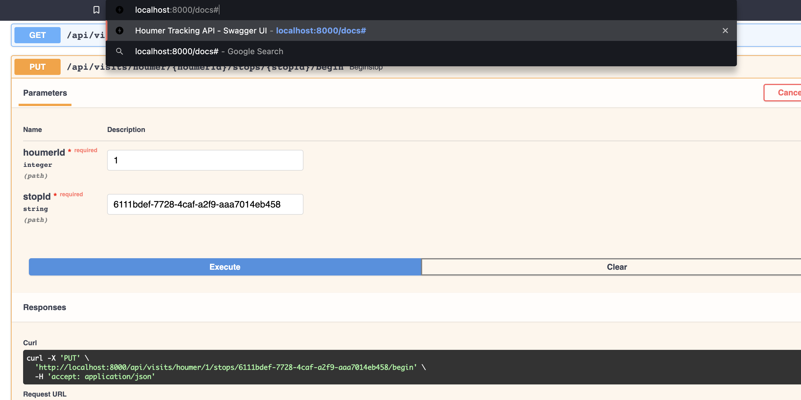

# Houmer Tracking Api 

Houm tracking api permite realizar las siguientes capacidades de negocio:
 1. Agendar visitas para cada houmer, cada visita contendra una parada la cual el houmer visitara
 2. Actualizar la posicion actual del houmer
 3. Actualizar los estados de las paradas que el houmer visitara
 4. Realizar consultas sobre las paradas visitadas por el houmer usando distintos parametros de busqueda
 
 Para ver la documentacion y especificacion de la api, es necesario visitar la pagina https://editor.swagger.io/ y copiar en esta pagina el contenido del archivo api.yaml, el cual esta almacenado en la ruta /documentation/api

Otra forma de revisar e interactuar con la api es consultar el endpoint de documentacion, por ejemplo visitar http://localhost:8000/docs




## API endpoints

**HealthCheck**: Endpoint encargado de retornar el estado de la aplicacion, pensado para despliegues en orquestador de contenedores como kubernetes.
Curl Request:

```console
curl -X 'GET' \
  'http://localhost:8000/status' \
  -H 'accept: application/json'
```

**Agendar Visitas**
Agendar Visitas mediante el Id de houmer y por los ids de los lugares a visitar

```console
curl -X 'POST' \
  'http://localhost:8000/api/visits/houmer/HOUMER-ID' \
  -H 'accept: application/json' \
  -H 'Content-Type: application/json' \
  -d '{
  "currentLocation": {
    "longitude": 0,
    "latitude": 0
  },
  "places": [
    {
      "placeId": 1
    },
   { "placeId" : 2}
  ],
  "date": "19/03/2022"
}'
```
**Agendar Visitas**
Actualizar posicion del houmer

```console
curl -X 'PUT' \
  'http://localhost:8000/api/VISIT-ID/houmer/HOUMER-ID' \
  -H 'accept: application/json' \
  -H 'Content-Type: application/json' \
  -d '{
  "currentLocation": {
    "longitude": 0,
    "latitude": 0
  }
}'
```


**Consultar Paradas pora un houmer con id de visita**
Obtener las paradas agendadas para un houmer

```console
curl -X 'GET' \
  'http://localhost:8000/api/visits/VISIT-ID/houmer/HOUMER-ID/stops' \
  -H 'accept: application/json'
```

**Iniciar ruta hacia parada mediante un stopId**
Iniciar la ruta hacia parada agendada a un houmer

```console
curl -X 'PUT' \
  'http://localhost:8000/api/visits/houmer/HOUMER-ID/stops/STOP-ID/begin' \
  -H 'accept: application/json'
```

**Completar ruta hacia parada mediante un stopId**
Completar la ruta hacia parada agendada a un houmer

```console
curl -X 'PUT' \
  'http://localhost:8000/api/visits/houmer/HOUMER-ID/stops/STOP-ID/complete' \
  -H 'accept: application/json'
```

**Iniciar visita a propiedad**

```console
curl -X 'PUT' \
  'http://localhost:8000/api/visits/houmer/HOUMER-ID/stops/STOP-ID/inspection/start' \
  -H 'accept: application/json'
```

**Terminar visita a propiedad**

```console
curl -X 'PUT' \
  'http://localhost:8000/api/visits/houmer/HOUMER-ID/stops/STOP-ID/inspection/complete' \
  -H 'accept: application/json'
```