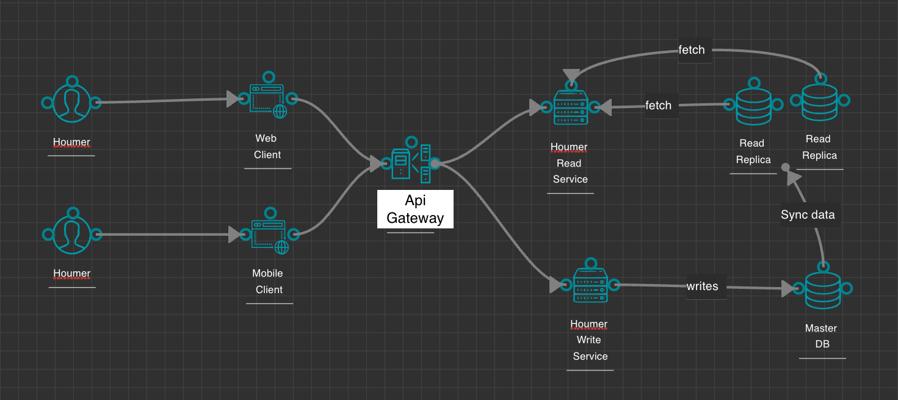
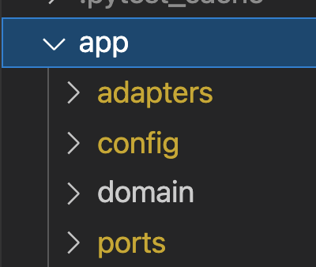
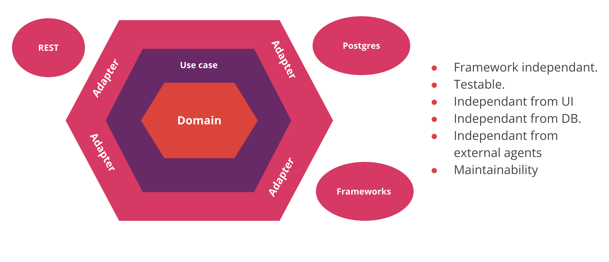

# Arquitectura de alto nivel Houmer Tracking-APP

## Requerimientos funcionales

Crear un servicio REST que:

- Permita que la aplicación móvil mande las coordenadas del Houmer
- Para un día retorne todas las coordenadas de las propiedades que visitó el houmer y cuanto tiempo se quedó en cada una
- Para un día retorne todos los momentos en que el houmer se trasladó con una velocidad superior a cierto parámetro

## Requerimientos no funcionales

### Escalabilidad

El sistema debe ser altamente escalable, por lo cual se utilizaran multiples instancias del servicio, el cual sera desplegado en kubernates.

- Es necesario contar con un api-gateway para distribuir los request a las instancias desplegadas en kubernates, a demas de proveer servicios de limitacion de request (rate limiter) y seguridad mediante api-keys
- A nivel de base de datos se utilizara una base de datos SQL (postgres) con un esquema main, replicas para asi separar las operaciones de lecturas de las operaciones de escritura, de esta forma es posible escalar de forma horizontal.

### Disponibilidad

- Es necesasrio contar con multiples instancias del servicio y con un esquema main,replicas a nivel de base de datos de forma de asegurar evitar puntos de fallos.

### Seguridad

- El sistema estara bajo la proteccion de api-gateway para asi limitar su uso para clientes no autorizados

### Mantenibilidad

- Se elige implementar arquitectura hexagonal de forma tal de encapsular y separar logica y entidades de negocio, de agentes externos relacionados a la tecnologia, como por ejemplo frameworks y librerias, de esta forma es mas facil remplazar esos agentes sin la necesidad de modificar logica y entidades de negocio

### Diagrama de arquitectura de alto nivel

### Diagrama de arquitectura de aplicación

A nivel interno se determino que la mejor opcion es implementar arquitectura hexagonal (https://alistair.cockburn.us/hexagonal-architecture)

La motivacion principal es separar tecnologia de logica de negocio, por lo que la aplicacion esta agrupada de la siguiente forma:

- adapters: Se identifican los componentes de salida de la aplicacion, como por ejemplo bases de datos, cache o servicios externos, en este caso solo tenemos un adaptador que esta relacionado con la capa de persistencia (PostGres)
- ports: Son la entrada a la aplicacion, pueden ser servicios rest, grpc o graphql, en este caso son endpoints rest
- domain: esta compuesta por las entidades de negocio y casos de uso.

