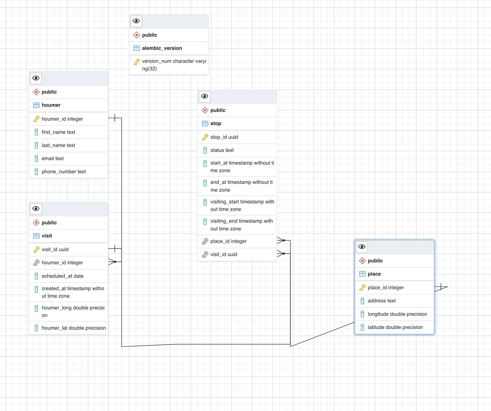

# Persistencia

Se opto por elegir una base de datos de tipo relacional, que nos permite almacenar la informacion y garantizar consistencia de datos.

La aplicacion usa alembic para migraciones y versiones de cambios a nivel de persistencia y sql alchemy como ORM.

A continuación se presenta el diagrama de Entidad relacion:

